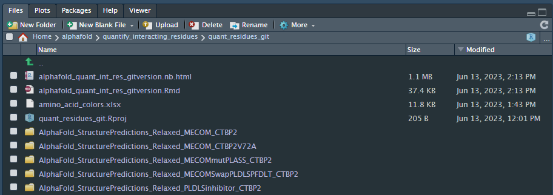

Dorien Pastoors `r format(Sys.time(), '%d %B, %Y')`
 
# Description and purpose

**Here, I'm plotting which residues are frequently involved in protein-protein interactions in AlphaFold predicted structures.**
With [ChimeraX](https://www.rbvi.ucsf.edu/chimerax/), it is possible to determine which residues in a heterodimer structure could interact with each other.  In a heterodimer structure there are two chains (called A and B), which represent the two sequences that went into AlphaFold. AlphaFold generates multiple predictions per run (default 25). With a Python/ChimeraX script I iterated over all the structures predicted by my AlphaFold prediction and generated html-formatted .txt files for each structure that contain interaction information. In this R markdown, I'm importing these .txt files and using ggplot to count & plot the interaction frequency per residue.

## Interaction in ChimeraX

There are multiple ways to determine which residues can be interacting in ChimeraX:

* they can be close together (how close?)
* a certain portion of the protein surface is interacting with each other
* they can engage in h-bonds 

The following chimerax commands identify interacting residues in different ways:

* interfaces select /B contacting /A
* interfaces select /A & ::polymer_type>0 contacting /B & ::polymer_type>0 areaCutoff 0
* hbonds (/A & protein) restrict (/B & protein) reveal true showDist true select true log true


The difference between 1) and 2) is that the default areaCutoff for interfaces is 300 Asq. " Interfaces with at least interface-area buried (default 300 Å2, can be changed with the areaCutoff option) are counted as interface" 
[chimerax documentation](https://www.rbvi.ucsf.edu/chimerax/docs/user/commands/interfaces.html )

The interaction files generated can be recognised by their suffix intResidues.txt. I will first try the import with the interfaces cmd and afterwards for the hbond cmd.

## Data availability

* The scripts are available on [Github](https://github.com/dorienpastoors/EVI1_CTBP2_PLDLSinhibitor/tree/main)
* All structures and the generated txt files are available for download at ZENODO_LINK
* In the ZENODO_LINK repository, there are zipped files starting with AlphaFold_StructurePredictions. 
* The zipped folders should be unzipped in an accesible directory from where this script is executed.
* to color amino acids, an excel file is included in this github which contains the amino acid color scheme

This analysis can be reproduced from the .PDB files, or from the already pre-determined interaction files.

***

**To reproduce from the .PDB files** 

* PDB files are available from ZENODO_LINK. Each .pdb file is in a folder which has a name that refers to the interaction that was modelled in that particular structure.
* Make a .txt file accessible from where you intend to run the python scripts with filepaths to the .pdb files you want to include in your analysis
* In the python script, change the directory to where the .PDB files & the .txt file are located on your computer
* **Run the python script by opening it in chimerax** (just use the "open" button like you would with a normal structure - it is a Python script but for use within chimerax only, so you cannot run it with a default python interpreter only)

**This will re-determine which residues are interacting in the provided structures and generate a .txt file for each .pdb file you included **

***

**To reproduce only from the pre-determined interactions**
It is also possible to use the interaction files I generated to re-create the plots shown in our article. For that you just need to download the data from ZENODO_LINK and set up your directory like the picture below. You should be able to run this script going from there. 

If you would like to run this script as-is, make sure the folder where your current working directory is looks like this: 



***

# Preparing the workspace


```{r message=FALSE, warning=FALSE, include=FALSE}


library(ggrepel)
library(tidyverse)
library(ggpubr)
library(scales)
library(MetBrewer)
library(xml2)
library(seqinr)
library(ggExtra)
library(readxl)

options(bitmapType = 'cairo')


```

# Get all the filenames

These are patterns that identify the .txt files made with the default interfaces cmd, (intfiles), the nominArea interfaces cmd, or the hbonds cmd. See above for explanation.

```{r}


intfiles <- list.files(recursive = TRUE, pattern = "intResidues.txt$" )


intfiles_noMinArea <- list.files(recursive = TRUE, pattern = "intResidues_noMinArea.txt$")


intfiles_hbonds <- list.files(recursive = TRUE, pattern = "intResidues_hbonds.txt$")


```

# Read the first file

## Interfaces CMD

In this file, there are 7 residues in chain A (CTBP2) which contact 6 residues in MECOM (chainB)

```{r}
# read HTML file
html <- read_lines(intfiles[1])

# The info we need is after the info selection residue command - where is this in the file?
cmdlines <- which(grepl("info selection level residue", html))

html[c(cmdlines[1], cmdlines[1]+1, cmdlines[1]+2)]


# how many residues are found that are interacting?
intresidues <- which(grepl("div>.+contacting residues", html))

html[intresidues]


```
The total number of interaction is important information for the function to write, as if there is no interaction, we cannot find residues that are interacting of course. So lets start writing a function that can detect the number of residues based on these two strings:

* From A to B, this is behind the string stored in variable pattern_a_to_b
* From B to A, this is behind string in variable pattern_b_to_a


```{r}
pattern_b_to_a = ">interfaces select /B contacting /A</a></div></div>.+ contacting residues"

pattern_a_to_b = ">interfaces select /A contacting /B</a></div></div>.+ contacting residues"


extract_int_residues <- function(pattern, html_lines){
  
  extracted <- html[grepl(pattern, html)]
  
  extracted <- str_extract(extracted, pattern = pattern)
  
  extracted <- str_extract(extracted, pattern = "</div></div>.+ contacting residues")
  
  extracted <- gsub("</div></div>", "", extracted)
  
  extracted <- gsub(" contacting residues", "", extracted)
  
  return(as.numeric(extracted))
  
}


extract_int_residues(pattern_a_to_b, html)
extract_int_residues(pattern_b_to_a, html)

```

So, lets now look at a file where there is no interaction:


```{r}
# read HTML file
html <- read_lines(intfiles[76])

# The info we need is after the info selection residue command - where is this in the file?
cmdlines <- which(grepl("info selection level residue", html))

html[c(cmdlines[1], cmdlines[1]+1, cmdlines[1]+2)]

# how many residues are found that are interacting?
intresidues <- which(grepl("div>.+contacting residues", html))

html[intresidues]


```
Firstly, you can see there are 0 interacting resudues in chain B touching chainA, and 0 chain A residues touching chain B. We can of course with this with our own function we just made.


```{r}

extract_int_residues(pattern_a_to_b, html)
extract_int_residues(pattern_b_to_a, html)

```
It works :)

In addition, you can see the amino-acid level output is in the form "residue id #5/B:950 name SER index 949<br>". In addition, you can see the first interacting residue is on the same line as the command.

This means we cannot just extract the lines starting with "residue id". We need to extract all information between "residue id #" and the first <br> that follows. You can identify this with the regular expression pattern "residue id .+<br>". The .+ in this regular expression means: any number of characters of any type. 

Below, I'm first making an index to see which lines contain this pattern, and then extracting them. I've noticed that while fiddling around with chimerax I've duplicated this command in the output so I also need to exclude lines that are exact duplicates of each other.

```{r}

html <- read_lines(intfiles[1])

index <- which(grepl("residue id .+<br>", html))

html_f <- html[index]

match_str <- str_extract(pattern = "residue id .+<br>", string = html_f)

match_str <- match_str[!duplicated(match_str)]

match_str

```

Yay! 13 lines are extracted, so 7 from chainB and 6 from chain A.

## Reformatting the extracted lines to a data table

A residue can interact with multiple residues on another protein - it does not need to be 1:1

I would like to make a table with the name of the structure, the chain where interaction occurs and the amino acid identity.

Note that there are two indexes for each letter.  In R counting, which starts at 1, we should use the higher residue. However, with other languages that start at 0, this might be residue 15. 


```{r}
int_df <- data.frame(chimera = match_str)

int_df <- int_df %>%
  separate(chimera, sep = ":", remove = FALSE, into = c("chain", "res") ) %>%
  mutate(chain = gsub("residue id /", "", chain)) %>%
  separate(res, sep = " ", into = c("index", NA, "residue", NA, NA)) %>%
  group_by(chain) %>%
  mutate(n_res = n()) %>% ungroup %>%
  mutate(file = "current_file")


```

## Hbonds

The hbonds cmd gives quite a different data format with a single table with the donor and acceptor of the hbond, so no separate cmds for a-to-b or b-to-a

Two files, where one does not have interaction and the other one does. The amount of H-bonds is before H-bonds on a single line

```{r}


html <- read_lines(intfiles_hbonds[1])

n_hbonds <- html[grepl(pattern = "\\d+ H-bonds$", html)]

n_hbonds <- as.numeric(gsub(" H-bonds", "", n_hbonds))

```

The table follows after this line, so if we can get the index of this line we know the lines that contains the table

```{r}
index <- which(grepl(pattern = "\\d+ H-bonds$", html))

index <- c((index+1):(index+1+n_hbonds))

html_f <- html[c(index)]

html_f

```
All the info is here! lets reformat the first line so we can use it as a header


```{r}
header <- html_f[1]

header <- gsub("H-bonds \\(", "", header)

header <- gsub("\\):", "", header)

header <- gsub(",", "", header)

html_f[1] <- header

strsplit(html_f, split = "\\s+")

hbond_df <- data.frame(chimera = html_f[-1])

hbond_df <- hbond_df %>%
  separate(chimera, remove = FALSE, sep = "\\s+", 
           into = c("donor_chain", "donor_residue", "donor_index", "donor_chemgroup",
                    "acceptor_chain", "acceptor_residue", "acceptor_index", "acceptor_chemgroup",
                    "hydrogen_chain", "hydrogen_residue", "hydrogen_index", "hydrogen_chemgroup",
                    "D..A_dist", "D-H..A_dis"))

head(hbond_df)
```
This table is actually much more detailed that the contact dataframe from the interfaces command. To be able to merge them I'm reformatting the table to a similar dataframe so I can make similar plots for either

```{r}

donor <- hbond_df[,c(1:5)]

acceptor <- hbond_df[,c(1,6:9)]

colnames(donor) <- gsub("donor_", "", colnames(donor))

donor$hbond_role <- "donor"

colnames(acceptor) <- gsub("acceptor_", "", colnames(acceptor))

acceptor$hbond_role <- "acceptor"

hbond_to_contacts <- rbind(donor, acceptor)
  


```


# Define import function

Lets write this into a function to do this for all our files.

```{r}
extract_int_residues <- function(pattern, html_lines){
  
  extracted <- html_lines[grepl(pattern, html_lines)]
  
  extracted <- str_extract(extracted, pattern = pattern)
  
  extracted <- str_extract(extracted, pattern = "</div></div>.+ contacting residues")
  
  extracted <- gsub("</div></div>", "", extracted)
  
  extracted <- gsub(" contacting residues", "", extracted)
  
  return(as.numeric(extracted))
  
}
```

## Interfaces cmd

```{r}
import_chimerax_contacts <- function(filepaths, chimerax_cmd_AtoB = "interfaces select /A contacting /B"){
  #chimerax command as it appears in the HTML file
  
  if(grepl("interfaces", chimerax_cmd_AtoB)){  
    
    pattern_a_to_b = paste0(">", chimerax_cmd_AtoB, "</a></div></div>.+ contacting residues")
    
    pattern_b_to_a = gsub("A", "X", pattern_a_to_b)
    
    pattern_b_to_a = gsub("B", "A", pattern_b_to_a)
    
    pattern_b_to_a = gsub("X", "B", pattern_b_to_a)
    
  }

  
  for(i in 1:length(filepaths)){
    
    current_file <- filepaths[i]
    
    html <- read_lines(current_file)
    
    a_to_b <- extract_int_residues(pattern_a_to_b, html)
    b_to_a <- extract_int_residues(pattern_b_to_a, html)
    
    # print(a_to_b + b_to_a)
    if(a_to_b + b_to_a > 0){
      
      index <- which(grepl("residue id .+<br>", html))
      
      html_f <- html[index]
      
      match_str <- str_extract(pattern = "residue id .+<br>", string = html_f)
      
      match_str <- match_str[!duplicated(match_str)]
      
      int_df <- data.frame(chimera = match_str)
      
      int_df <- int_df %>%
        separate(chimera, sep = ":", remove = FALSE, into = c("chain", "res") ) %>%
        mutate(chain = gsub("residue id /", "", chain)) %>%
        separate(res, sep = " ", into = c("index", NA, "residue", NA, NA)) %>%
        group_by(chain) %>%
        mutate(n_res = n()) %>% ungroup %>%
        mutate(file = current_file)
      
    }
    
    if(a_to_b + b_to_a == 0){
      int_df <- data.frame(chimera = NA, chain =c("A", "B"), index = NA, residue = NA, n_res = c(0,0), file = current_file)
      #print(" no contacts were found, placeholder DF was created") 
    }
    
    
    if(i == 1){
      final_int_df = int_df
    }
    else{
      final_int_df = rbind(final_int_df, int_df)
    }
    
  }

  return(final_int_df)
}

chimerax_contacts <- import_chimerax_contacts(intfiles)

chimerax_con_noMinArea <- import_chimerax_contacts(intfiles_noMinArea, 
                                                   chimerax_cmd_AtoB = "interfaces select /B &amp; ::polymer_type&gt;0 contacting /A &amp; ::polymer_type&gt;0 areaCutoff 0")


```

## Hbonds

```{r}
import_chimerax_hbonds <- function(filepaths){
  
  for(i in 1:length(filepaths)){
    
    # print(i)
    # read file and determine number of hbonds
    
    current_file <- filepaths[i]
    
    html <- read_lines(filepaths[i])
    
    n_hbonds <- html[grepl(pattern = "\\d+ H-bonds$", html)]
    
    n_hbonds <- as.numeric(gsub(" H-bonds", "", n_hbonds))
    
    if(n_hbonds>0){
      
      # filter out the hbonds from the html file
      index <- which(grepl(pattern = "\\d+ H-bonds$", html))
      
      index <- c((index+1):(index+1+n_hbonds))
      
      html_f <- html[c(index)]
      
      #convert to dataframe
      
      hbond_df <- data.frame(chimera = html_f[-1])
      
      hbond_df <- hbond_df %>%
        separate(chimera, remove = FALSE, sep = "\\s+", 
                 into = c("donor_chain", "donor_residue", "donor_index", "donor_chemgroup",
                          "acceptor_chain", "acceptor_residue", "acceptor_index", "acceptor_chemgroup",
                          "hydrogen_chain", "hydrogen_residue", "hydrogen_index", "hydrogen_chemgroup",
                          "D..A_dist", "D-H..A_dis"))
      
      # hbond_df is the full dataframe with all info but we discard it here!
      head(hbond_df)
      
      
      #extract donor and acceptor residues and melt together
      
      donor <- hbond_df[,c(1:5)]
      
      acceptor <- hbond_df[,c(1,6:9)]
      
      colnames(donor) <- gsub("donor_", "", colnames(donor))
      
      donor$hbond_role <- "donor"
      
      colnames(acceptor) <- gsub("acceptor_", "", colnames(acceptor))
      
      acceptor$hbond_role <- "acceptor"
      
      hbond_to_contacts <- rbind(donor, acceptor)
      
      hbond_to_contacts$file <- current_file
      
      hbond_to_contacts$n_res <- n_hbonds
    }
    
    
    else{
      hbond_to_contacts <- data.frame(chimera = NA, chain =c("A", "B"),  residue = NA,index = NA,chemgroup = NA,  hbond_role = NA,
                            file = current_file, n_res = c(0,0))
      #print(" no contacts were found, placeholder DF was created") 
    }
    
    
    if(i == 1){
      hbond_contacts = hbond_to_contacts
    }
    else{
      hbond_contacts = rbind(hbond_contacts, hbond_to_contacts)
    }
    
    
    
  }
  
  return(hbond_contacts)
  
  
}

chimerax_con_hbonds <- import_chimerax_hbonds(filepaths = intfiles_hbonds)


```


# Add fasta sequence info

The alphafold predictions are based on the .FASTA folders in the corresponding directories. 

Here, iw ould like to add the corresponding fasta file that has the sequence information. For me, the fasta files are inside the folders that contain the predicted structures.


```{r}

fasta_files <- list.files(recursive = TRUE, pattern = ".fasta$")

fasta_files <- data.frame(fasta_file = fasta_files)

fasta_files <- fasta_files %>% 
  separate(fasta_file, into = c("folder", NA), remove = FALSE, sep = "/")


# merge with contacts df

chimerax_contacts <- chimerax_contacts %>%
  separate(col = file, into = c( "folder", NA),sep = "/", remove = FALSE)

chimerax_contacts <- merge(chimerax_contacts, fasta_files, by = "folder", all.x = TRUE)

# all(file.exists(chimerax_contacts$fasta_file)) # check if yourf asta files are correct

# write.table(chimerax_contacts, "chimerax_contacts.txt")


chimerax_con_hbonds <- chimerax_con_hbonds %>%
  separate(col = file, into = c("folder", NA),sep = "/", remove = FALSE) 

chimerax_con_hbonds <- merge(chimerax_con_hbonds, fasta_files, by = "folder", all.x = TRUE)

# all(file.exists(chimerax_con_hbonds$fasta_file))

# write.table(chimerax_con_hbonds, "chimerax_contacts_hbond.txt")

chimerax_con_noMinArea <- chimerax_con_noMinArea %>%
  separate(col = file, into = c("folder", NA),sep = "/", remove = FALSE) 

chimerax_con_noMinArea <- merge(chimerax_con_noMinArea, fasta_files, by = "folder", all.x = TRUE)

# all(file.exists(chimerax_con_noMinArea$fasta_file))

# write.table(chimerax_con_noMinArea, "chimerax_contacts_noMinArea.txt")


```


```{r}
all_fasta <- fasta_files$fasta_file

```


## extract sequence for 1 heterodimer

Each structure prediction file contains 2 sequences (A and B)
These are made from my fasta files, where the first protein is chain A, and the second chain B

```{r}


aa_seq <- read.fasta(all_fasta[1], as.string = TRUE)

aa_df <- data.frame(residue = unlist(strsplit(aa_seq[[1]][1], split = "")))

aa_df <- aa_df %>%
  mutate(index = 1:n())

chain_name_A = attr(aa_seq[[1]], "name")

chain_name_B = attr(aa_seq[[2]], "name")

chain_name_A
chain_name_B

```

* to extract the sequence, I'm filtering first the contacts for all contacts that involve the currently selected fasta file (nr 1)

* i then find how many predictions were made for that fasta file (25

)

```{r}
chimerax_contacts_f <- chimerax_contacts%>%filter(fasta_file ==all_fasta[1] )

n_predictions <- length(unique(chimerax_contacts_f$file))

n_predictions

chimerax_contacts_fA <- chimerax_contacts_f %>% filter(chain == "A")

# make a dataframe where for each index it says how often it is involved in the interaction

chimerax_contacts_fA <- chimerax_contacts_fA %>% 
  group_by(index, residue) %>%
  summarise(count = n()) %>%ungroup


aa_df <- merge(aa_df, chimerax_contacts_fA, by = "index", all.x = TRUE)

aa_df$count[is.na(aa_df$count)] <- 0

aa_df$fraction <- aa_df$count*100/n_predictions

head(aa_df)
```

# Determine zoom window

I want to be able to determine the zoom needed for a plot by plotting the region here most interactions occur. For this, I need to sum interactions per hypothetical window to pick the maximum window. **How wide should this window be in order to create a clear maximum ?** 

```{r}
for(windowsize in c(5,10,20,30,50,100, 15)){
  
  aa_df_temp <- aa_df %>%
    mutate(lagsum = RcppRoll::roll_sum(count, n = windowsize, align = "center", fill = 0))
  
  ggplot(data = aa_df_temp, aes(x = index, y = lagsum))+
    geom_line()+
    theme_classic2()+
    ggtitle(paste0("windowsize_", windowsize))
  
  ggsave(paste0("plots/windowsizeplot_10CTBP2_windowsize_", windowsize, ".png"), width = 12, height = 3)
  
}


last_plot()

```

This code creates all the plots in de for loop, but I'm only showing one here in the HTML file. 
I think the windowsize of 10 gives the clearest result, but this may depend on the type of interaction residue (for PLDLS we know its small). For CTBP2 30 seems better. However, 15 gives a clear peak in both.


# plot try-outs

## import amino acid colors


```{r}
amino_acid_colors <- read_excel("amino_acid_colors.xlsx")

aacols1 <- amino_acid_colors$color

names(aacols1) <- tolower(amino_acid_colors$oneletter)

aacols3 <- amino_acid_colors$color

names(aacols3) <- toupper(amino_acid_colors$threeletter)


```
## plots examples

In this section you can see the different plots created

### 1. just a barplot (+ ylim as option)

```{r}

ggplot(data = aa_df, aes(x = index, y = count, fill = residue.x))+
  geom_col()+
  #ylim(c(0,100))+
  theme_classic2()+
  scale_fill_manual(values = aacols1)


```

### 2. zoom barplot

```{r fig.width=12, fig.height=4}

ggplot(data = aa_df, aes(x = index, y = count, fill = residue.x))+
  geom_col()+
  #ylim(c(0,100))+
  theme_classic2()+
  coord_cartesian(xlim = c(50,100))+
  scale_x_continuous(breaks = c(50:100), labels = aa_df$residue.x[c(50:100)])+
  scale_fill_manual(values = aacols1)+
  theme(legend.position = "none")

```

### 3. heatmap

(this is what I ultimately used, I cropped these for illustrator)

```{r, fig.width=12, fig.height=3}
dens <- density(aa_df$fraction)

dens <- data.frame(x = dens$x, y = dens$y)

# heatmap
h1 <- ggplot(data = aa_df, aes(xmin = index-0.5, xmax = index+0.5, ymin = 0, ymax = 1, fill = count))+
  geom_rect()+
  scale_fill_viridis_c(option = "E")+
  theme(legend.position = "none")+
  theme_classic2()

h1

# zoom heatmap
h1 + geom_rect(color = "white", fill = NA )+
  coord_cartesian(xlim = c(50,100))+
  scale_x_continuous(breaks = c(50:100), labels = aa_df$residue.x[c(50:100)])

# zoom heatmap
ggplot(data = aa_df, aes(xmin = index-0.5, xmax = index+0.5, ymin = 0, ymax = 1, fill = count))+
  geom_rect(color = "white")+
  scale_fill_viridis_c(option = "E")+
  theme(legend.position = "none")+
  theme_classic2()+
  coord_cartesian(xlim = c(50,100))+
  scale_x_continuous(breaks = c(50:100), labels = aa_df$residue.x[c(50:100)])
```

### 4. per-structure plot

This gives more information regarding in which structures residues were interacting and whether interactions co-occur in the same structure predictions. So, if you have n =5 on adjacent residues READY do you have 5 structures where R is involved, 5 with E, etc. or just 5 structures where all READY residues were involved.

```{r}

chimerax_contacts_fA_only <- chimerax_contacts_f%>%filter(chain == "B") %>%
  mutate(index = as.integer(index))


p1<- ggplot(data = chimerax_contacts_fA_only, aes(x = index, y = file, fill = residue))+
  geom_point(alpha = 0)+
  geom_tile(color = "black")+
  scale_fill_manual(values= aacols3)+
  theme_classic2()+
  theme(axis.text.y = element_blank(), axis.text.x = element_text(angle = 90, hjust = 1, vjust = 0.5))


ggMarginal(p1, type = "histogram", margins = "x", xparams = list(binwidth = 25))

ggplot(data = chimerax_contacts_fA_only, aes(x = index, y = file, fill = residue))+
  geom_tile(color = "black")+
  scale_fill_manual(values= aacols3)+
  scale_x_continuous(limits = c(750,800))+
  theme_classic2()+
  theme(axis.text.y = element_blank(), axis.text.x = element_text(angle = 90, hjust = 1, vjust = 0.5))
  
  
```

# Plot functions


**Structure of plot function**

for each alphafold folder
*  import chains
*  filter chimerax data
*  for chains in structure
  +  make filename
  +  filter data
  +  colPlot 
  +  structureHeatmap
  +  if chain > 100AAs
  +    determine zoom window
  +    colPlotZoom
  +    structureHeatmapZoom
    
    
```{r import and window support funs}
importProteinSeqs <- function(fastafile){
  #input: a fasta file with 2 sequences
  
  # exports each sequence as a dataframe (index and residue)
  
  # exports the name of each sequence
  
  # returns a list of df1, df2 and the name vector
  
  aa_seq <- read.fasta(fastafile, as.string = TRUE)
  
  aa_df1 <- data.frame(residue = unlist(strsplit(aa_seq[[1]][1], split = "")))
  
  aa_df1 <- aa_df1 %>%
    mutate(index = 1:n())
  
  aa_df2 <- data.frame(residue = unlist(strsplit(aa_seq[[2]][1], split = "")))
  
  aa_df2 <- aa_df2 %>%
    mutate(index = 1:n())
  
  chain_name_A = attr(aa_seq[[1]], "name")

  chain_name_B = attr(aa_seq[[2]], "name")
  
  chains <- c(chain_name_A, chain_name_B)
  
  names(chains) <- c("A", "B")
  
  return(list(aa_df1, aa_df2, chains))
  
  
}


determineZoomWindow <- function(aa_dataframe, window_size = 15){
  
  # input is the amino acid dataframe with columns index and count
  
  # determines a rolling window sum of count, to see in which width of the window size most counts are
  
  # it then filters for the highest rolling sum and returns a min,max zoom window that does not exceed the protein boundaries
  
  aa_dataframe <- aa_dataframe %>%
    mutate(lagsum = RcppRoll::roll_sum(count, n = window_size, align = "center", fill = 0))
  
  window <- aa_dataframe %>%slice_max(lagsum, with_ties = FALSE, n = 1)
  
  window <- c(window$index-25, window$index+25)
  
  # check if the window does not go beyond the protein limits
  
  if(window[1]<min(aa_dataframe$index)){
    window[1] = min(aa_dataframe$index)
  }
  
  if(window[2]>max(aa_dataframe$index)){
    window[2] = max(aa_dataframe$index)
  }
  
  return(window)
}
```


```{r plot functions}
colPlot <- function(aa_dataframe, plot_title, plot_subtitle, 
                    save_directory, color_vector, zoom_window = NULL ){
  
  
  p1 <- ggplot(data = aa_dataframe, aes(x = index, y = count, fill = residue.x))+
    geom_col()+
    #ylim(c(0,100))+
    theme_classic2()+
    scale_fill_manual(values = color_vector)+
    ggtitle(plot_title, plot_subtitle)
  
  
  
  if(!is.null(zoom_window)){
    
    break_index = c(zoom_window[1]:zoom_window[2])
    
    p1 <- p1 + scale_x_continuous(limits = zoom_window, 
                                  breaks = break_index, 
                                  labels = aa_dataframe$residue.x[break_index])
    
    ggsave(filename = file.path(save_directory, paste0("colplot/colPlot_Zoom_", plot_title, ".png")), width = 10, height = 4)
    ggsave(filename = file.path(save_directory, paste0("colplot/colPlot_Zoom_", plot_title, ".pdf")), width = 10, height = 4)
    
    
  }
  else{
    ggsave(filename = file.path(save_directory, paste0("colplot/colPlot_", plot_title, ".png")), width = 10, height = 4)
    ggsave(filename = file.path(save_directory, paste0("colplot/colPlot_", plot_title, ".pdf")), width = 10, height = 4)
  }
  
}

#colPlot(aa_dataframe = aa_df, " zoom_temp", "temp", plot_direc, aacols1, zoom_window = determineZoomWindow(aa_df))


perStructureIntPlot <- function(chimera_chain_dataframe, plot_title, plot_subtitle, 
                                save_directory, color_vector, zoom_window = NULL, protein_size = NULL){
  
  if(is.null(protein_size)){lims = NULL}
  else{ lims = c(1, protein_size)}
  
  p1 <- ggplot(data = chimera_chain_dataframe, aes(x = index, y = file, fill = residue))+
    geom_point(alpha = 0)+
    geom_tile(color = "black")+
    scale_x_continuous(limits =lims )+
    scale_fill_manual(values= color_vector)+
    theme_bw()+
    theme(axis.text.y = element_blank(), axis.text.x = element_text(angle = 90, hjust = 1, vjust = 0.5))
  
  
  if(is.null(zoom_window)){
    
    p2 <- ggMarginal(p1, type = "histogram", margins = "x", xparams = list(binwidth = 25))
    
    ggsave(filename = file.path(save_directory, paste0("perStructurePlot/perStructurePlot_", plot_title, ".png")),p2,  width = 8, height = 6)
    ggsave(filename = file.path(save_directory, paste0("perStructurePlot/perStructurePlot_", plot_title, ".pdf")), p2, width = 8, height = 6)
    
  }
  else{
    
    p2 <- p1+scale_x_continuous(limits = zoom_window)
    
    ggsave(filename = file.path(save_directory, paste0("perStructurePlot/perStructurePlot_Zoom_", plot_title, ".png")),p2,  width = 8, height = 6)
    ggsave(filename = file.path(save_directory, paste0("perStructurePlot/perStructurePlot_Zoom_", plot_title, ".pdf")), p2, width = 8, height = 6)
    
  }
  
}

#perStructureIntPlot(chimerax_contacts_fA_only, "temptitlezoom", "tempsub", plot_direc, aacols3, protein_size = 1230)

heatmap1DPlot <- function(aa_dataframe, plot_title, plot_subtitle, 
                          save_directory, zoom_window = NULL, viridis_option = "E", color_scale_limits = NULL){
  
  if(!is.null(color_scale_limits)){aa_dataframe$count <- factor(aa_dataframe$count, levels = c(color_scale_limits[1]:color_scale_limits[2]))}
  else{aa_dataframe$count <- factor(aa_dataframe$count, levels = c(0:max(aa_dataframe$count)))}
  
  # heatmap
  h1 <- ggplot(data = aa_dataframe, aes(xmin = index-0.5, xmax = index+0.5, ymin = 0, ymax = 1, fill = count))+
    geom_rect()+
    scale_fill_viridis_d(option = viridis_option, drop = FALSE)+
    theme(legend.position = "none")+
    theme_classic2()+
    ggtitle(plot_title, plot_subtitle)+
    theme(axis.text.y = element_blank(), axis.ticks.length.y = unit(0, "cm"))
  
  h1
  if(is.null(zoom_window)){
    ggsave(filename = file.path(save_directory, paste0("heatmap1D/heatmap1D_", plot_title, ".png")),h1,  width = 8, height = 2)
    ggsave(filename = file.path(save_directory, paste0("heatmap1D/heatmap1D_", plot_title, ".pdf")), h1, width = 8, height = 2)
    
  }
  
  else{
    # zoom heatmap
    break_index = c(zoom_window[1]:zoom_window[2])
    
    h2 <- h1 + geom_rect(color = "white", fill = NA )+
      scale_x_continuous(limits = zoom_window, 
                         breaks = break_index, 
                         labels = aa_dataframe$residue.x[break_index])
    
    print(file.path(save_directory, paste0("heatmap1D_zoom_", plot_title, ".png")))
    ggsave(filename = file.path(save_directory, paste0("heatmap1D/heatmap1D_zoom_", plot_title, ".png")),h2,  width = 8, height = 2)
    ggsave(filename = file.path(save_directory, paste0("heatmap1D/heatmap1D_zoom_", plot_title, ".pdf")), h2, width = 8, height = 2)
    
  }
  
}


# 
# heatmap1DPlot(aa_df, "temptitlez", "tempsubtitle", plot_direc, zoom_window = determineZoomWindow(aa_df))

```


```{r main functions}
plotStructureInteraction <- function(chimerax_interactions, fasta_name, save_directory, aa_3cols , aa_1cols, 
                                     manual_zoom = NULL, colPlot = TRUE, perStructureplot = TRUE, heatmap1Dplot = TRUE, 
                                     virisletter = "E", heatmap_color_scale_limits = NULL){
  
  pred_name <- gsub(".fasta", "", fasta_name)
  
  pred_name <- gsub("~/alphafold/", "", pred_name)
  
  sequences <- importProteinSeqs(fasta_name)
  
  chimerax_int <- chimerax_interactions %>% dplyr::filter(fasta_file == fasta_name)
  
  print(nrow(chimerax_int))
  
  n_predictions <- length(unique(chimerax_int$file))
  
  chains = c("A", "B")
  
  for(i in 1:length(chains)){
    
    chimera_chain <- chimerax_int %>% filter( chain == chains[i]) %>% mutate(index = as.numeric(index))
    
    chimera_chain_summary <- chimera_chain %>% 
      group_by(index, residue) %>%
      summarise(count = n()) %>%ungroup
    
    aa_df <- sequences[[i]]
    
    protein_size = nrow(aa_df)
    
    aa_df <- merge(aa_df, chimera_chain_summary, by = "index", all.x = TRUE)
    
    aa_df$count[is.na(aa_df$count)] <- 0
    
    aa_df$fraction <- aa_df$count*100/n_predictions
    
    # plot standards
    
    plot_prefix = paste0(pred_name, "_", sequences[[3]][i])
    
    subtitle = paste0("Chain of ", sequences[[3]][i], "in complex with ", sequences[[3]][c(3-i)])
    
    # start the zoom out plots, only if no manual window is specified
    if(is.null(manual_zoom)){
      print("no manual window provided; proceed with default windows")
      if(heatmap1Dplot){heatmap1DPlot(aa_dataframe = aa_df, plot_title = plot_prefix, 
                                      plot_subtitle = subtitle, save_directory = save_directory, viridis_option = virisletter, 
                                        color_scale_limits  = heatmap_color_scale_limits)}
      
      if(colPlot){colPlot(aa_dataframe = aa_df, plot_title = plot_prefix, 
                          color_vector = aa_1cols, plot_subtitle = subtitle, save_directory = save_directory)}
      
      if(perStructureplot){perStructureIntPlot(chimera_chain_dataframe = chimera_chain, plot_title = plot_prefix, 
                                               color_vector = aa_3cols, plot_subtitle = subtitle, save_directory = save_directory, protein_size = protein_size )}
      
      # make zoom in only for large proteins
      if(nrow(aa_df)>100){
        print("zooming in on most affected window")
        windowsize = determineZoomWindow(aa_df)
        
        if(heatmap1Dplot){heatmap1DPlot(aa_dataframe = aa_df, plot_title = plot_prefix, 
                                        plot_subtitle = subtitle, save_directory = save_directory, zoom_window = windowsize, viridis_option = virisletter, 
                                        color_scale_limits  = heatmap_color_scale_limits)}
        
        if(colPlot){colPlot(aa_dataframe = aa_df, plot_title = plot_prefix, 
                            color_vector = aa_1cols, plot_subtitle = subtitle, save_directory = save_directory, zoom_window = windowsize)}
        
        if(perStructureplot){perStructureIntPlot(chimera_chain_dataframe = chimera_chain, plot_title = plot_prefix, 
                                                 color_vector = aa_3cols, plot_subtitle = subtitle, save_directory = save_directory, 
                                                 zoom_window = windowsize, protein_size = protein_size)}
        
        
        
      }}
    else{
      # find the corresponding window
      
      index <- which(sapply(names(manual_zoom), FUN = grepl, x = sequences[[3]][i] ))
      
      print(index)
      
      if(length(index)>0){
        
        print("manual window specified as list; sequence name found in the sequence object")
        windowsize = manual_zoom[[index]]
        
        plot_prefix <- paste0(plot_prefix, "_manualWindow_")
        
        if(heatmap1Dplot){heatmap1DPlot(aa_dataframe = aa_df, plot_title = plot_prefix, 
                                        plot_subtitle = subtitle, save_directory = save_directory, zoom_window = windowsize, viridis_option = virisletter, 
                                        color_scale_limits  = heatmap_color_scale_limits)}
        
        if(colPlot){colPlot(aa_dataframe = aa_df, plot_title = plot_prefix, 
                            color_vector = aa_1cols, plot_subtitle = subtitle, save_directory = save_directory, zoom_window = windowsize)}
        
        if(perStructureplot ){perStructureIntPlot(chimera_chain_dataframe = chimera_chain, plot_title = plot_prefix, 
                                                  color_vector = aa_3cols, plot_subtitle = subtitle, save_directory = save_directory, 
                                                  zoom_window = windowsize, protein_size = protein_size)}
      }
      
    }
    
  }
  
  
}


```


# Generate plots 

## Interfaces (default)

### different zoom windows

```{r}
manual_zoom_list <- list(c(730,780), c(39,89))

names(manual_zoom_list) <- c("MECOM", "CTBP")
```


```{r, warning=FALSE, message=FALSE}

for(i in 1:length(all_fasta)){
  
  plotStructureInteraction(chimerax_interactions = chimerax_contacts, 
                           fasta_name = all_fasta[i], 
                           save_directory = ".", 
                           aa_3cols = aacols3, 
                           aa_1cols = aacols1, 
                           colPlot = TRUE, heatmap1Dplot = TRUE, perStructureplot = FALSE)
  
  
  
}


for(i in 1:length(all_fasta)){
  
  plotStructureInteraction(chimerax_interactions = chimerax_contacts, 
                           fasta_name = all_fasta[i], 
                           save_directory = ".", 
                           aa_3cols = aacols3, 
                           aa_1cols = aacols1, 
                           manual_zoom = manual_zoom_list, 
                           colPlot = TRUE, heatmap1Dplot = TRUE, perStructureplot = TRUE)
  
  
  
}


```

### fix scales  for counting interactions

using the heatmap_color_scale_limits, you can control waht the limits are for the heatmap scale


```{r, warning=FALSE, message=FALSE}
for(i in 1:length(all_fasta)){
  
  plotStructureInteraction(chimerax_interactions = chimerax_contacts, 
                           fasta_name = all_fasta[i], 
                           save_directory = "./fixed_colScale", 
                           aa_3cols = aacols3, aa_1cols = aacols1, 
                           colPlot = FALSE, heatmap1Dplot = TRUE, perStructureplot = FALSE, 
                           heatmap_color_scale_limits = c(0,5))
  
  
  
}


for(i in 1:length(all_fasta)){
  
  plotStructureInteraction(chimerax_interactions = chimerax_contacts, all_fasta[i], 
                           save_directory =  "./fixed_colScale", 
                           aa_3cols = aacols3, aa_1cols = aacols1, 
                           manual_zoom = manual_zoom_list, 
                           colPlot = FALSE, heatmap1Dplot = TRUE, perStructureplot = FALSE,
                           heatmap_color_scale_limits = c(0,5))
  
  
  
}
```
  
 

### change heatmap color

using virisletter, you can use a different letter from the viridis package to use another color scheme. For more info, see:

[viridis letters overview](https://sjmgarnier.github.io/viridis/reference/scale_viridis.html)

```{r, warning=FALSE, message=FALSE}

for(i in 1:length(all_fasta)){
  
  plotStructureInteraction(chimerax_interactions = chimerax_contacts, 
                           fasta_name = all_fasta[i], 
                           save_directory = "./heatmap1D_viridisF", 
                           aa_3cols = aacols3, aa_1cols = aacols1, 
                           colPlot = FALSE, heatmap1Dplot = TRUE, perStructureplot = FALSE, virisletter = "F")
  
  
  
}


for(i in 1:length(all_fasta)){
  
  plotStructureInteraction(chimerax_interactions = chimerax_contacts, all_fasta[i],  
                           save_directory = "./heatmap1D_viridisF_0to4",
                           aa_3cols = aacols3, aa_1cols = aacols1, 
                           manual_zoom = manual_zoom_list, 
                           colPlot = FALSE, heatmap1Dplot = TRUE, perStructureplot = FALSE, virisletter = "F",
                           heatmap_color_scale_limits = c(0,4))
  
  
  
}


```


## minArea

by changing the chimerax interactions argument to the noMinArea you can regenerate the plots for the other contact dataframes. 
```{r, warning=FALSE, message=FALSE}

for(i in 1:length(all_fasta)){
  
  plotStructureInteraction(chimerax_interactions = chimerax_con_noMinArea, all_fasta[i], 
                           save_directory = "./noMinArea", aa_3cols = aacols3, aa_1cols = aacols1, 
                           colPlot = FALSE, heatmap1Dplot = FALSE)
  
  
  
}


```

## Hbonds plots

hbonds can occur in 1 residue multiple times. before running the function i will remove duplicate residues
In addition, in the hbonds df, there is chain /A as well as chain A and it needs to be A

```{r}
chimerax_con_hbonds <- chimerax_con_hbonds %>%
  group_by(file, chain) %>%
  mutate(dup_residue = duplicated(index)) %>%ungroup()

chimerax_con_hbonds_singleRes <- chimerax_con_hbonds %>%
  filter(!dup_residue) %>%
  select(chimera, chain, index, residue, n_res, file, folder, fasta_file) %>%
  mutate(chain = gsub("/", "", chain, fixed = TRUE))
```

afterwards we can use the function in the same way

```{r, warning=FALSE, message=FALSE}
for(i in 1:length(all_fasta)){
  
  plotStructureInteraction(chimerax_interactions = chimerax_con_hbonds_singleRes, 
                           all_fasta[i], 
                           save_directory = "./hbonds", 
                           aa_3cols = aacols3, aa_1cols = aacols1, 
                           colPlot = FALSE, heatmap1Dplot = FALSE)
  
  
  
}

# manual zoom window

manual_zoom_list <- list(c(740,790), c(39,89))

names(manual_zoom_list) <- c("MECOM", "CTBP")


for(i in 1:length(all_fasta)){
  
  plotStructureInteraction(chimerax_interactions = chimerax_con_hbonds_singleRes, 
                           all_fasta[i], 
                           "./hbonds", 
                           aa_3cols = aacols3, aa_1cols = aacols1, 
                           manual_zoom = manual_zoom_list)
  
  
  
}

# viridis F heatmap

for(i in 1:length(all_fasta)){
  
  plotStructureInteraction(chimerax_interactions = chimerax_con_hbonds_singleRes, all_fasta[i], 
                            save_directory = "./hbonds_heatmap1D_viridisF", 
                           aa_3cols = aacols3, aa_1cols = aacols1,
                           colPlot = FALSE, heatmap1Dplot = TRUE, perStructureplot = FALSE, virisletter = "F")
  
  
  
}


```


hope this is useful for anyone
